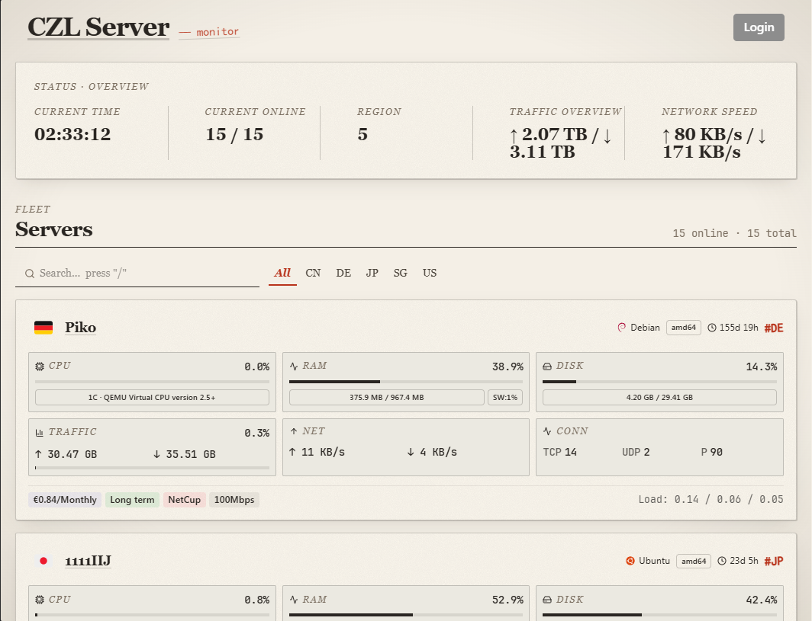

# Komari Paper

A **paper-and-handwritten** theme for [Komari Monitor](https://github.com/komari-monitor/komari) — warm cream background, Fraunces serif type, restrained Caveat handwritten accents, and JetBrains Mono numerals. Inspired by *Stripe Press*, *Maggie Appleton*, *Are.na*.



## Install

1. Download `komari-paper-vYY.MM.DD.zip` from the [Releases](https://github.com/woodchen-ink/komari-paper/releases) page.
2. In Komari admin → **Theme Management** → upload the zip.
3. Switch the active theme to *Komari Paper*.

## Theme settings

The Komari admin theme settings panel exposes the same keys as the default theme:

- `showIpTagsInCard` — show IPv4 / IPv6 tags on the home card
- `showServerListInDetails` — show the server list sidebar on the detail page
- `backgroundImageUrlDesktop` / `backgroundImageUrlMobile` — overlay a custom image as a sepia "tucked photo" on top of the paper
- `offlineServerPosition` — `First` / `Keep` / `Last`
- `customFooterHtml` — custom footer markup
- `mainContentWidth` — content max width in vw

## Design notes

- Single light theme — no dark mode (paper is paper)
- Warm white `#f4efe6` paper with a subtle SVG noise grain
- Cards have unique sub-degree tilts via `nth-child`, hover snaps back to 0°
- Type pairing: Fraunces (variable opsz/SOFT/WONK) + LXGW WenKai (Chinese) + Caveat (annotations) + JetBrains Mono (numbers)
- Editorial accents only where they earn their place: eyebrow labels, drop cap, hairline rules, hand-written group annotations

## Development

```bash
npm install
npm run dev      # Vite dev server
npm run build    # tsc + vite build → dist/
npm run lint
```

To produce a theme zip locally (Linux / macOS / WSL):

```bash
./build-theme.sh
```

The zip contains `dist/` + `komari-theme.json` + `preview.png`.

## Releases

Pushing to `main` triggers `.github/workflows/release.yaml`:

- Stamps `komari-theme.json` with `version = YY.MM.DD[-N]`
- Builds, packages `komari-paper-vYY.MM.DD[-N].zip`
- Creates a GitHub Release with auto-generated changelog

## Credits

Forked from [komari-liquidglass](https://github.com/woodchen-ink/komari-liquidglass), which itself adapted [komari-monitor/komari-web](https://github.com/komari-monitor/komari-web). Original Komari authors retain all credit for the data layer and admin panel.

## License

MIT (matches upstream Komari).
